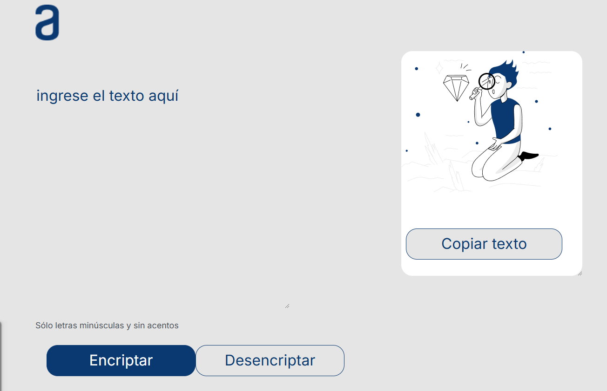
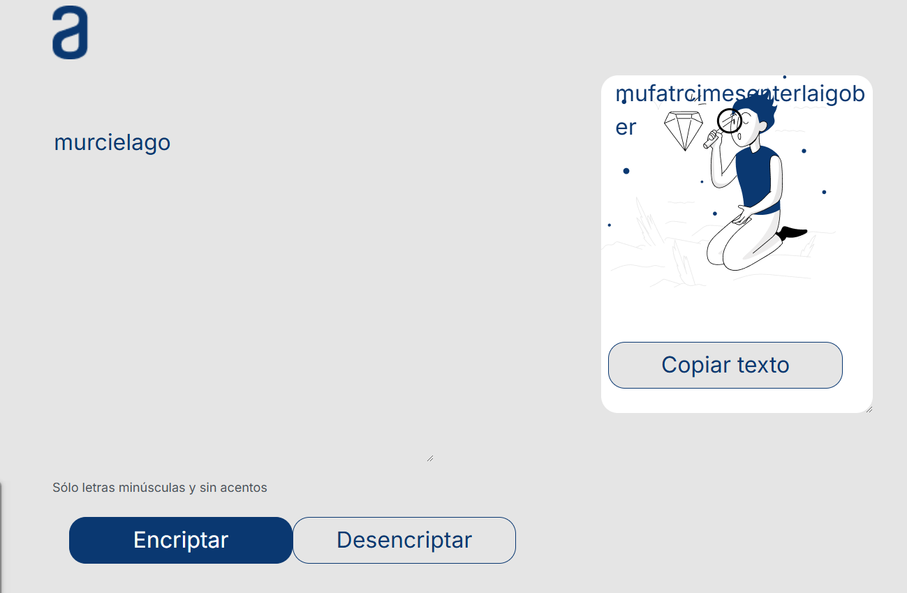
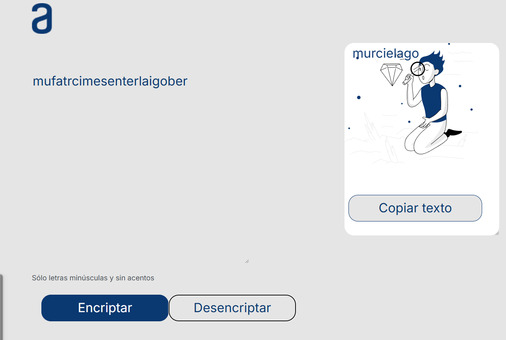

# 🔐 Encrypt and Decrypt V.1

A simple yet powerful web-based tool that allows you to encrypt and decrypt words using a custom algorithm.

## ✨ Features
- 🔒 Encrypts words using a custom transformation algorithm.
- 🔓 Decrypts back to the original word.
- 🖥️ Simple UI with HTML, CSS, and JavaScript.
- 🚀 No external libraries required.

## 🚀 How to Use
1. Enter a word in the input field.

2. Click the "Encrypt" button to transform it.

3. Copy the encrypted text and decrypt it anytime.

## 🛠️ Built With
- HTML
- CSS
- JavaScript

## 👨‍💻 Author
- **CalalpaGus** - [GitHub](https://github.com/CalalpaGus/)

